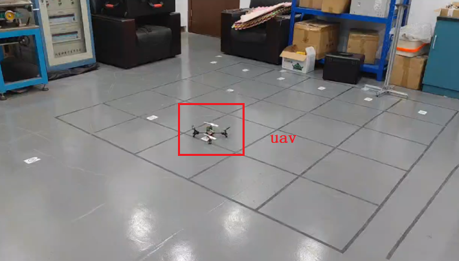
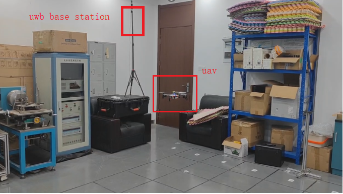

### UWB based Quadrotor Swarm Demo System
 Utilize UWB indoor localization technology to develop demos based on quad-rotor drones swarm, formation  control, task distribution and collaborative coverage.

#### code
``Eular_angle.py`` is the TF python code on Eular angles. (用python实现的坐标变换)
#### experiment
The video can be seen in 

